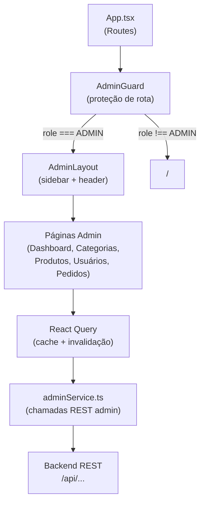
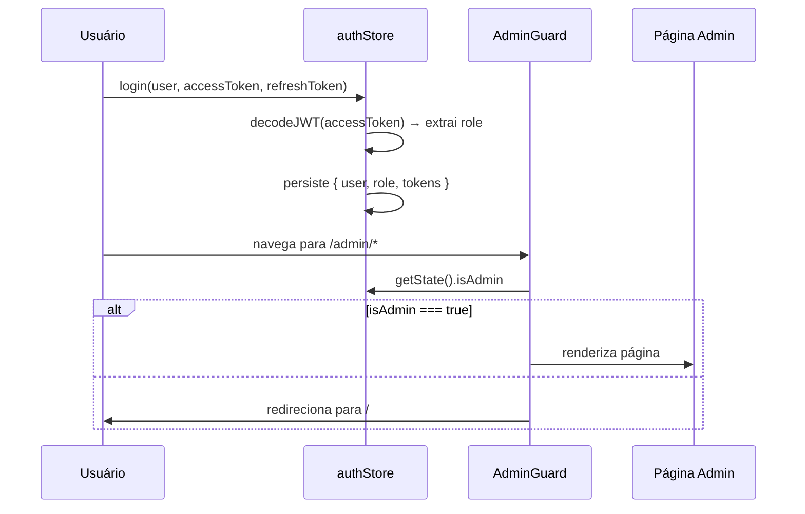

# Design Document — Admin Panel

## Overview

O Admin Panel é uma área restrita do frontend `frescor-link-novo` acessível exclusivamente a usuários com role `ADMIN`. Ele centraliza o gerenciamento operacional do e-commerce: categorias, produtos, usuários, pedidos e relatórios/métricas.

A implementação reutiliza a infraestrutura existente do projeto:
- **Autenticação**: `authStore` (Zustand) + interceptor Axios em `api.ts`
- **Cache e fetching**: React Query (`@tanstack/react-query`)
- **UI**: shadcn/ui + Tailwind CSS
- **Roteamento**: React Router v6

O `authStore` será estendido para extrair e expor o claim `role` do JWT, eliminando a necessidade de chamadas adicionais ao backend para verificação de permissão.

---

## Architecture



### Fluxo de autenticação e role



---

## Components and Interfaces

### 1. authStore (atualização)

O `authStore` existente será estendido para incluir `role` e `isAdmin`:

```typescript
// src/stores/authStore.ts (extensão)
type Role = "ADMIN" | "USER";

interface AuthState {
  // campos existentes...
  role: Role | null;
  isAdmin: boolean;
  // login atualizado para extrair role do JWT
  login: (user: User, access: string, refresh: string) => void;
}
```

A função `login` usará `jwtDecode` (biblioteca `jwt-decode`) para extrair o claim `role` do `accessToken` sem chamada ao backend.

### 2. AdminGuard

```typescript
// src/components/AdminGuard.tsx
// Componente wrapper de rota que verifica isAdmin do authStore.
// - isAdmin === true  → renderiza <Outlet />
// - isAuthenticated === false → redireciona para /
// - isAuthenticated === true, isAdmin === false → redireciona para / com toast de acesso negado
```

### 3. AdminLayout

```typescript
// src/components/admin/AdminLayout.tsx
// Layout com:
// - Sidebar (shadcn/ui Sidebar) com links de navegação
// - Header com nome/email do admin e botão "Sair"
// - <Outlet /> para conteúdo das páginas filhas
// - Sidebar colapsável em mobile (< 768px) via SidebarProvider
```

Links do sidebar:
| Rota | Label | Ícone |
|---|---|---|
| /admin/dashboard | Dashboard | LayoutDashboard |
| /admin/categorias | Categorias | Tag |
| /admin/produtos | Produtos | Package |
| /admin/usuarios | Usuários | Users |
| /admin/pedidos | Pedidos | ShoppingCart |

### 4. adminService.ts

Serviço centralizado para todas as operações administrativas:

```typescript
// src/services/adminService.ts
export const adminService = {
  // Usuários
  getUsuarios: (page, size) => api.get<PageResponse<AdminUser>>("/usuarios", ...),
  updateUsuarioRole: (id, role) => api.put(`/usuarios/${id}/role`, { role }),

  // Pedidos
  getPedidos: (page, size, status?) => api.get<PageResponse<AdminPedido>>("/pedidos", ...),
  getPedidoById: (id) => api.get<AdminPedidoDetalhe>(`/pedidos/${id}`),
  updatePedidoStatus: (id, status) => api.put(`/pedidos/${id}/status`, { status }),

  // Categorias (CRUD completo)
  getCategorias: (page, size) => api.get<PageResponse<Category>>("/categorias", ...),
  createCategoria: (data) => api.post("/categorias", data),
  updateCategoria: (id, data) => api.put(`/categorias/${id}`, data),
  deleteCategoria: (id) => api.delete(`/categorias/${id}`),

  // Produtos (CRUD completo)
  getProdutos: (page, size, filters?) => api.get<PageResponse<Product>>("/produtos", ...),
  createProduto: (data) => api.post("/produtos", data),
  updateProduto: (id, data) => api.put(`/produtos/${id}`, data),
  deleteProduto: (id) => api.delete(`/produtos/${id}`),
};
```

### 5. Páginas Admin

| Arquivo | Rota | Responsabilidade |
|---|---|---|
| `src/pages/admin/Dashboard.tsx` | /admin/dashboard | Métricas e gráficos |
| `src/pages/admin/Categorias.tsx` | /admin/categorias | CRUD categorias |
| `src/pages/admin/Produtos.tsx` | /admin/produtos | CRUD produtos |
| `src/pages/admin/Usuarios.tsx` | /admin/usuarios | Listagem + alterar role |
| `src/pages/admin/Pedidos.tsx` | /admin/pedidos | Listagem + atualizar status |

### 6. Integração React Query

Cada página usa hooks customizados com query keys padronizadas:

```typescript
// Query keys
["admin", "categorias", { page, size }]
["admin", "produtos", { page, size, nome, categoriaId }]
["admin", "usuarios", { page, size }]
["admin", "pedidos", { page, size, status }]
["admin", "pedido", id]

// Após mutação bem-sucedida:
queryClient.invalidateQueries({ queryKey: ["admin", "categorias"] })
```

---

## Data Models

### JWT Payload (claim extraído)

```typescript
interface JwtPayload {
  sub: string;       // email
  id: string;
  nome: string;
  email: string;
  role: "ADMIN" | "USER";
  exp: number;
  iat: number;
}
```

### AdminUser

```typescript
interface AdminUser {
  id: string;
  nome: string;
  email: string;
  role: "ADMIN" | "USER";
  criadoEm: string;
}
```

### AdminPedido

```typescript
interface AdminPedido {
  id: string;
  usuario: { id: string; nome: string; email: string };
  status: "PENDENTE" | "PAGO" | "ENVIADO" | "ENTREGUE" | "CANCELADO";
  total: number;
  dataPedido: string;
}

interface AdminPedidoDetalhe extends AdminPedido {
  itens: Array<{
    produtoId: string;
    nomeProduto: string;
    quantidade: number;
    precoUnitario: number;
  }>;
}
```

### PageResponse (genérico — já existe em productService, será centralizado)

```typescript
interface PageResponse<T> {
  content: T[];
  totalPages: number;
  totalElements: number;
  number: number; // página atual (0-indexed)
}
```

### Formulários (React Hook Form + Zod)

```typescript
// Categoria
const categoriaSchema = z.object({
  nome: z.string().min(1, "Nome é obrigatório"),
  descricao: z.string().optional(),
});

// Produto
const produtoSchema = z.object({
  nome: z.string().min(1, "Nome é obrigatório"),
  preco: z.number().positive("Preço deve ser positivo"),
  estoque: z.number().int().nonnegative("Estoque não pode ser negativo"),
  categoriaId: z.string().optional(),
  descricao: z.string().optional(),
  imagemUrl: z.string().url().optional().or(z.literal("")),
});
```

---

## Routing (App.tsx — atualização)

```typescript
// Novas rotas a adicionar em App.tsx
<Route element={<AdminGuard />}>
  <Route path="/admin" element={<AdminLayout />}>
    <Route index element={<Navigate to="/admin/dashboard" replace />} />
    <Route path="dashboard" element={<Dashboard />} />
    <Route path="categorias" element={<Categorias />} />
    <Route path="produtos" element={<Produtos />} />
    <Route path="usuarios" element={<Usuarios />} />
    <Route path="pedidos" element={<Pedidos />} />
  </Route>
</Route>
```

---

## Correctness Properties

*A property is a characteristic or behavior that should hold true across all valid executions of a system — essentially, a formal statement about what the system should do. Properties serve as the bridge between human-readable specifications and machine-verifiable correctness guarantees.*

---

### Property 1: AdminGuard bloqueia acesso sem role ADMIN

*For any* usuário (não autenticado ou autenticado com role `USER`), ao tentar acessar qualquer rota sob `/admin`, o `AdminGuard` deve redirecionar para `/` sem renderizar nenhum conteúdo do painel.

**Validates: Requirements 1.2, 1.3**

---

### Property 2: AdminGuard permite acesso com role ADMIN

*For any* usuário autenticado com role `ADMIN`, o `AdminGuard` deve renderizar o conteúdo do painel (`<Outlet />`) sem redirecionar.

**Validates: Requirements 1.1**

---

### Property 3: Extração de role do JWT é correta

*For any* JWT válido contendo o claim `role`, a função de decode do `authStore` deve extrair e armazenar exatamente o valor do claim `role` sem realizar chamada ao backend.

**Validates: Requirements 1.4**

---

### Property 4: Links do sidebar navegam para rotas corretas

*For any* item do menu lateral do `AdminLayout`, o `href` associado deve corresponder exatamente à rota esperada para aquele módulo.

**Validates: Requirements 2.2**

---

### Property 5: Header exibe dados do usuário autenticado

*For any* usuário admin autenticado com `nome` e `email` no `authStore`, o cabeçalho do `AdminLayout` deve exibir exatamente esses valores.

**Validates: Requirements 2.3**

---

### Property 6: Mutação CRUD envia request correto e invalida cache

*For any* operação de criação, edição ou exclusão bem-sucedida em qualquer módulo (Categorias, Produtos), a requisição HTTP enviada deve conter o método e payload corretos, e o cache React Query correspondente deve ser invalidado após a resposta de sucesso.

**Validates: Requirements 3.2, 3.3, 3.4, 4.2, 4.3, 4.4, 8.4**

---

### Property 7: Validação de formulário rejeita entradas inválidas

*For any* submissão de formulário com campos inválidos (nome vazio/whitespace, preço ≤ 0, estoque negativo), o formulário não deve disparar a requisição ao backend e deve exibir mensagem de validação inline.

**Validates: Requirements 3.6, 4.6**

---

### Property 8: Tabela de usuários exibe todos os campos obrigatórios

*For any* lista de usuários retornada pelo backend, cada linha da tabela deve exibir `id`, `nome`, `email`, `role` e `criadoEm`.

**Validates: Requirements 5.2**

---

### Property 9: Admin não pode alterar a própria role

*For any* estado do `authStore` com um `user.id` definido, o controle de edição de role na linha da tabela de usuários cujo `id` coincide com `user.id` deve estar desabilitado.

**Validates: Requirements 5.5**

---

### Property 10: Atualização de role/status envia request correto

*For any* alteração de role de usuário ou status de pedido confirmada pelo admin, a requisição `PUT` deve ser enviada com o novo valor e a linha da tabela deve refletir o novo estado após resposta de sucesso.

**Validates: Requirements 5.3, 6.3**

---

### Property 11: Tabela de pedidos exibe todos os campos obrigatórios

*For any* lista de pedidos retornada pelo backend, cada linha deve exibir `id`, nome do usuário, `status`, `total` e `dataPedido`.

**Validates: Requirements 6.2**

---

### Property 12: Filtro de pedidos por status envia query param correto

*For any* status selecionado no filtro de pedidos, a requisição `GET /pedidos` deve incluir o parâmetro `status` com o valor selecionado.

**Validates: Requirements 6.4**

---

### Property 13: Agrupamento de pedidos por data é correto

*For any* lista de pedidos com datas variadas, a função de agrupamento por período deve produzir grupos onde cada pedido aparece exatamente uma vez no grupo correspondente à sua data.

**Validates: Requirements 7.2**

---

### Property 14: Ranking de produtos mais vendidos é correto

*For any* lista de pedidos com itens, a função de ranking deve ordenar os produtos em ordem decrescente de quantidade total vendida, sem omitir nenhum produto presente nos itens.

**Validates: Requirements 7.3**

---

### Property 15: Filtro por intervalo de datas exclui pedidos fora do intervalo

*For any* intervalo de datas `[inicio, fim]` selecionado no relatório, todos os indicadores calculados devem considerar apenas pedidos cuja `dataPedido` está dentro do intervalo (inclusive nos extremos).

**Validates: Requirements 7.4**

---

### Property 16: Toast de feedback reflete resultado da operação

*For any* mutação bem-sucedida, um toast de sucesso deve ser exibido. *For any* mutação que falha com erro do backend, um toast de erro deve ser exibido com a mensagem do backend ou fallback genérico.

**Validates: Requirements 8.2, 8.3**

---

## Error Handling

### Erros de rede e HTTP

O interceptor Axios existente em `api.ts` já trata respostas `401` com logout automático. O `adminService` não precisa tratar 401 diretamente.

Para outros erros (400, 403, 404, 500), cada hook de mutação React Query deve:
1. Capturar o erro no callback `onError`
2. Extrair `error.response?.data?.message` ou usar mensagem de fallback
3. Exibir toast de erro via `useToast` (hook existente)
4. Manter o formulário aberto (não fechar o Dialog/Sheet)

### Erros de validação (frontend)

Zod + React Hook Form tratam validação antes do submit. Mensagens inline são exibidas abaixo de cada campo inválido. O botão de submit fica desabilitado enquanto o formulário é inválido.

### Estado de loading

React Query expõe `isLoading` / `isPending` para cada query e mutação. Cada seção usa:
- **Skeleton** (shadcn/ui) durante carregamento inicial de listas
- **Spinner** no botão de submit durante mutações em andamento

### Dados ausentes no Dashboard

Se qualquer query do dashboard falhar ou retornar dados vazios, o indicador correspondente exibe `0` ou `N/A`. Erros de query individuais não propagam para outros indicadores.

---

## Testing Strategy

### Abordagem dual: Unit Tests + Property-Based Tests

Os testes são complementares:
- **Unit tests**: exemplos concretos, casos de borda, integrações entre componentes
- **Property tests**: propriedades universais verificadas com centenas de inputs gerados

### Biblioteca de Property-Based Testing

**Vitest** (já configurado no projeto) + **fast-check** para geração de dados aleatórios.

```bash
npm install --save-dev fast-check
```

### Unit Tests (Vitest + React Testing Library)

Cobrem:
- Renderização do `AdminGuard` com diferentes estados do `authStore`
- Renderização do `AdminLayout` com links corretos
- Exibição de loading skeletons quando `isLoading=true`
- Clique em "Sair" chama `logout` do authStore
- Exibição de detalhes de pedido ao clicar em uma linha
- Dashboard exibe `0`/`N/A` quando dados ausentes

### Property-Based Tests (fast-check)

Cada propriedade do design é implementada por **um único** teste de propriedade com mínimo de **100 iterações**.

Tag format: `// Feature: admin-panel, Property {N}: {texto}`

Exemplos de implementação:

```typescript
// Property 3: Extração de role do JWT
// Feature: admin-panel, Property 3: Extração de role do JWT é correta
it("extrai role corretamente de qualquer JWT válido", () => {
  fc.assert(fc.property(
    fc.constantFrom("ADMIN", "USER"),
    fc.string({ minLength: 1 }),
    (role, userId) => {
      const token = generateMockJwt({ role, id: userId });
      const decoded = decodeJwtRole(token);
      expect(decoded).toBe(role);
    }
  ), { numRuns: 100 });
});

// Property 7: Validação de formulário
// Feature: admin-panel, Property 7: Validação rejeita entradas inválidas
it("rejeita nome vazio ou só whitespace", () => {
  fc.assert(fc.property(
    fc.stringMatching(/^\s*$/),
    (nome) => {
      const result = categoriaSchema.safeParse({ nome });
      expect(result.success).toBe(false);
    }
  ), { numRuns: 100 });
});

// Property 15: Filtro por intervalo de datas
// Feature: admin-panel, Property 15: Filtro por intervalo exclui pedidos fora do range
it("filtra pedidos corretamente por intervalo de datas", () => {
  fc.assert(fc.property(
    fc.array(arbitraryPedido()),
    fc.date(),
    fc.date(),
    (pedidos, d1, d2) => {
      const [inicio, fim] = d1 <= d2 ? [d1, d2] : [d2, d1];
      const resultado = filtrarPorIntervalo(pedidos, inicio, fim);
      expect(resultado.every(p =>
        new Date(p.dataPedido) >= inicio && new Date(p.dataPedido) <= fim
      )).toBe(true);
    }
  ), { numRuns: 100 });
});
```

### Cobertura por módulo

| Módulo | Unit Tests | Property Tests |
|---|---|---|
| authStore (role) | decode com token fixo | Property 3 |
| AdminGuard | estados concretos | Properties 1, 2 |
| AdminLayout | renderização, logout | Property 4, 5 |
| Categorias | CRUD com mock | Properties 6, 7 |
| Produtos | CRUD com mock | Properties 6, 7 |
| Usuários | tabela, self-edit | Properties 8, 9, 10 |
| Pedidos | tabela, filtro, detalhe | Properties 10, 11, 12 |
| Dashboard | métricas, dados ausentes | Properties 13, 14, 15 |
| Feedback | toast sucesso/erro | Property 16 |
