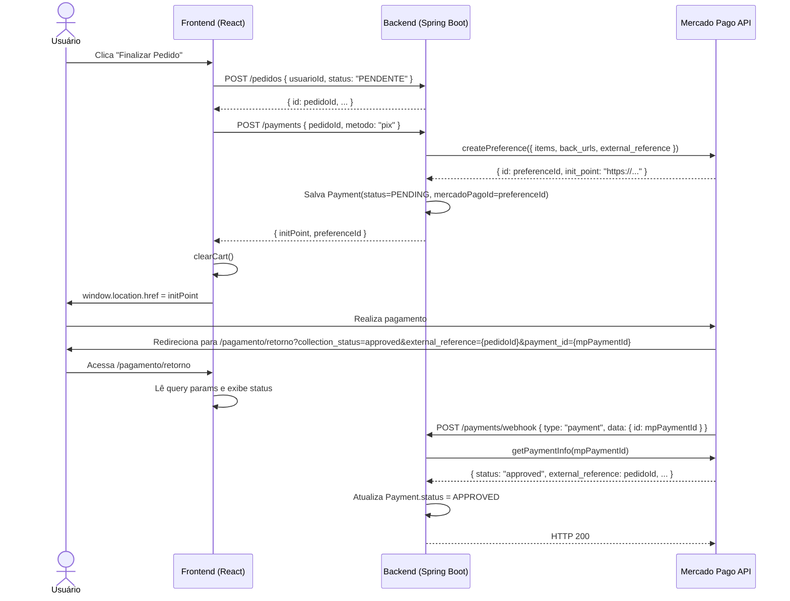
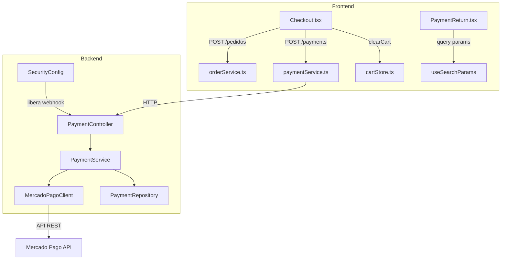

# Design: mercadopago-checkout

## Visão Geral

Esta feature corrige e completa a integração do Mercado Pago no fluxo de checkout da aplicação Frescor Link. O diagnóstico do código herdado identificou três problemas principais:

1. **Frontend**: `paymentService.ts` chama um endpoint inexistente (`/pagamentos/criar-preferencia`); `Checkout.tsx` cria o pedido mas não chama o serviço de pagamento nem redireciona para o `init_point`.
2. **Backend**: `PaymentService.createPaymentPreference()` salva o `Payment` no banco mas não chama `MercadoPagoClient.createPreference()`; `PaymentService.processWebhookPayment()` está completamente vazio.
3. **Segurança**: O endpoint `POST /payments/webhook` está bloqueado pelo `SecurityConfig` (exige JWT), impedindo que o Mercado Pago envie notificações.

O objetivo é conectar todas as peças existentes para que o fluxo completo funcione: **Checkout → Criar Pedido → Criar Preferência MP → Redirecionar → Retorno → Exibir Status**.

---

## Arquitetura

### Diagrama de Sequência — Fluxo Completo



### Visão de Componentes



---

## Componentes e Interfaces

### Backend

#### PaymentController (existente — sem alterações)

Endpoints já existentes:
- `POST /payments` — cria preferência de pagamento
- `GET /payments/{id}` — busca pagamento por ID
- `GET /payments/pedido/{pedidoId}` — busca pagamento por pedido
- `POST /payments/webhook` — recebe notificações do MP

#### PaymentService (a modificar)

**`createPaymentPreference(PaymentRequestDTO dto)`**

Fluxo atual (incompleto): salva Payment no banco sem chamar o MP.

Fluxo corrigido:
1. Buscar o pedido pelo `pedidoId` para obter os itens e o valor total
2. Montar o payload da preferência (ver seção Data Models)
3. Chamar `MercadoPagoClient.createPreference(payload)`
4. Salvar `Payment` com `status=PENDING` e `mercadoPagoId=preferenceId`
5. Retornar `{ initPoint, preferenceId }`

**`processWebhookPayment(String data)`**

Fluxo atual: vazio.

Fluxo corrigido:
1. Parsear o JSON recebido para extrair `type` e `data.id`
2. Se `type != "payment"`, retornar sem ação
3. Chamar `MercadoPagoClient.getPaymentInfo(mpPaymentId)`
4. Mapear o status retornado para `PaymentStatus` (ver mapeamento abaixo)
5. Buscar o `Payment` pelo `mercadoPagoId` e atualizar o status
6. Se não encontrado, logar e retornar sem exceção

**Mapeamento de status MP → PaymentStatus:**

| Status Mercado Pago | PaymentStatus |
|---------------------|---------------|
| `approved`          | `APPROVED`    |
| `rejected`          | `REJECTED`    |
| `cancelled`         | `CANCELLED`   |
| `in_process`        | `PENDING`     |
| `pending`           | `PENDING`     |
| outros              | `PENDING`     |

#### MercadoPagoClient (existente — sem alterações)

Métodos já funcionais:
- `createPreference(Map<String, Object> payload)` → retorna `Map<String, Object>`
- `getPaymentInfo(String paymentId)` → retorna `Map<String, Object>`

#### SecurityConfig (a modificar)

Adicionar permissão para `POST /payments/webhook` sem autenticação JWT, mantendo todos os demais endpoints de `/payments/*` protegidos.

### Frontend

#### paymentService.ts (a modificar)

```typescript
export interface CreatePreferencePayload {
  pedidoId: string;   // UUID
  metodo: string;     // ex: "pix", "credit_card"
}

export interface PreferenceResponse {
  initPoint: string;
  preferenceId: string;
}

export const paymentService = {
  createPreference: (payload: CreatePreferencePayload) =>
    api.post<PreferenceResponse>("/payments", payload),
};
```

#### Checkout.tsx (a modificar)

O `handleFinalize` deve ser atualizado para:
1. Criar pedido via `orderService.create()`
2. Chamar `paymentService.createPreference({ pedidoId: order.id, metodo: "pix" })`
3. Chamar `clearCart()`
4. Redirecionar via `window.location.href = initPoint`

Em caso de falha no passo 1: exibir toast, não prosseguir.
Em caso de falha no passo 2: exibir toast, manter carrinho intacto.

#### PaymentReturn.tsx (a criar)

Nova página em `src/pages/PaymentReturn.tsx`, acessível em `/pagamento/retorno`.

Lê os seguintes query params do Mercado Pago:
- `collection_status`: `approved` | `pending` | `failure`
- `external_reference`: `pedidoId`
- `payment_id`: ID do pagamento no MP

Comportamento por status:
- `approved`: mensagem de sucesso + botão "Ver meu pedido" → `/pedido/:id`
- `pending`: mensagem de análise + número do pedido
- `failure`: mensagem de falha + botão "Tentar novamente" → `/checkout`
- params ausentes: redirecionar para `/`

#### App.tsx (a modificar)

Adicionar a rota `/pagamento/retorno` apontando para `PaymentReturn`.

---

## Data Models

### Payload da Preferência MP (enviado ao MercadoPagoClient)

```json
{
  "items": [
    {
      "id": "pedido-{pedidoId}",
      "title": "Pedido #{pedidoId}",
      "quantity": 1,
      "unit_price": 150.00,
      "currency_id": "BRL"
    }
  ],
  "back_urls": {
    "success": "https://{frontend_url}/pagamento/retorno?collection_status=approved",
    "failure": "https://{frontend_url}/pagamento/retorno?collection_status=failure",
    "pending": "https://{frontend_url}/pagamento/retorno?collection_status=pending"
  },
  "auto_approve": false,
  "external_reference": "{pedidoId}",
  "notification_url": "https://{backend_url}/payments/webhook"
}
```

> O `external_reference` é o `pedidoId` (UUID), usado para correlacionar o retorno do MP com o pedido no banco.

### Resposta da Preferência MP (retornada pelo MercadoPagoClient)

```json
{
  "id": "1234567890-abcd-efgh",
  "init_point": "https://www.mercadopago.com.br/checkout/v1/redirect?pref_id=...",
  "sandbox_init_point": "https://sandbox.mercadopago.com.br/checkout/v1/redirect?pref_id=..."
}
```

### Payload do Webhook MP (recebido em POST /payments/webhook)

```json
{
  "type": "payment",
  "data": {
    "id": "123456789"
  }
}
```

### Resposta do getPaymentInfo (retornada pelo MercadoPagoClient)

```json
{
  "id": 123456789,
  "status": "approved",
  "status_detail": "accredited",
  "external_reference": "uuid-do-pedido",
  "transaction_amount": 150.00,
  "payment_method_id": "pix",
  "date_approved": "2024-01-15T10:30:00.000-03:00"
}
```

### Payment (entidade existente no banco)

| Campo           | Tipo          | Descrição                              |
|-----------------|---------------|----------------------------------------|
| `id`            | Long          | PK auto-incremento                     |
| `mercadoPagoId` | String        | ID da preferência ou do pagamento no MP |
| `pedido`        | FK (UUID)     | Referência ao pedido                   |
| `amount`        | BigDecimal    | Valor total do pagamento               |
| `status`        | PaymentStatus | PENDING / APPROVED / REJECTED / CANCELLED / REFUNDED |
| `paymentMethod` | String        | Método de pagamento (ex: "pix")        |
| `createdAt`     | LocalDateTime | Data de criação                        |
| `updatedAt`     | LocalDateTime | Data de atualização                    |

### PaymentResponseDTO (novo DTO de resposta)

```java
public record PaymentResponseDTO(
    String initPoint,
    String preferenceId
) {}
```

### Configuração (application.properties)

```properties
mercadopago.access-token=${MERCADOPAGO_ACCESS_TOKEN:test_token_change_in_production}
mercadopago.environment=${MERCADOPAGO_ENVIRONMENT:sandbox}
```

### Variáveis de Ambiente Frontend (.env.example)

```env
# Chave pública do Mercado Pago (obrigatória para o SDK do MP no frontend)
VITE_MP_PUBLIC_KEY=TEST-xxxxxxxx-xxxx-xxxx-xxxx-xxxxxxxxxxxx
```

---

## Propriedades de Corretude

*Uma propriedade é uma característica ou comportamento que deve ser verdadeiro em todas as execuções válidas de um sistema — essencialmente, uma declaração formal sobre o que o sistema deve fazer. Propriedades servem como ponte entre especificações legíveis por humanos e garantias de corretude verificáveis por máquina.*

### Propriedade 1: Payload do paymentService contém os campos obrigatórios

*Para qualquer* `pedidoId` (UUID) e `metodo` (string não vazia), a chamada a `paymentService.createPreference()` deve enviar um payload que contém exatamente os campos `pedidoId` e `metodo` com os valores fornecidos.

**Valida: Requisitos 1.2**

---

### Propriedade 2: Resposta do paymentService expõe initPoint e preferenceId

*Para qualquer* resposta HTTP 200 do backend contendo `initPoint` e `preferenceId`, o `paymentService.createPreference()` deve retornar um objeto com esses dois campos acessíveis ao chamador.

**Valida: Requisitos 1.3**

---

### Propriedade 3: Checkout chama paymentService com o pedidoId correto

*Para qualquer* pedido criado com sucesso pelo `orderService`, o `Checkout` deve chamar `paymentService.createPreference()` com o `pedidoId` exatamente igual ao `id` retornado pelo `orderService`.

**Valida: Requisitos 2.2**

---

### Propriedade 4: Checkout limpa carrinho e redireciona para qualquer initPoint válido

*Para qualquer* URL de `initPoint` retornada pelo `paymentService`, o `Checkout` deve chamar `clearCart()` e redirecionar o navegador para essa URL exata, sem modificações.

**Valida: Requisitos 2.3**

---

### Propriedade 5: createPaymentPreference delega ao MercadoPagoClient com dados do pedido

*Para qualquer* `PaymentRequestDTO` com `pedidoId` e `metodo` válidos, `PaymentService.createPaymentPreference()` deve chamar `MercadoPagoClient.createPreference()` com um payload que contém `external_reference` igual ao `pedidoId` e `items` com o valor total do pedido.

**Valida: Requisitos 3.1, 3.2**

---

### Propriedade 6: Payment salvo com status PENDING após criação da preferência

*Para qualquer* resposta bem-sucedida do `MercadoPagoClient.createPreference()`, o `Payment` persistido no banco deve ter `status = PENDING` e `mercadoPagoId` igual ao `id` retornado pelo Mercado Pago.

**Valida: Requisitos 3.3**

---

### Propriedade 7: Mapeamento de status MP para PaymentStatus é completo e correto

*Para qualquer* status retornado pelo `MercadoPagoClient.getPaymentInfo()`, o `PaymentService.processWebhookPayment()` deve atualizar o `Payment` com o `PaymentStatus` correspondente segundo a tabela de mapeamento: `approved→APPROVED`, `rejected→REJECTED`, `cancelled→CANCELLED`, `in_process/pending→PENDING`.

**Valida: Requisitos 4.2, 4.3, 4.4, 4.5**

---

### Propriedade 8: processWebhookPayment chama getPaymentInfo com o ID correto

*Para qualquer* payload de webhook com `type="payment"` e `data.id` não vazio, `PaymentService.processWebhookPayment()` deve chamar `MercadoPagoClient.getPaymentInfo()` com o valor de `data.id` exatamente como recebido.

**Valida: Requisitos 4.1**

---

## Tratamento de Erros

### Backend

| Cenário | Comportamento |
|---------|---------------|
| `MercadoPagoClient.createPreference()` lança exceção | `PaymentService` propaga; `PaymentController` retorna HTTP 502 |
| `ACCESS_TOKEN` não configurado | `PaymentController` retorna HTTP 503 com mensagem "Serviço de pagamento não configurado" |
| `MercadoPagoClient.getPaymentInfo()` lança exceção no webhook | `PaymentService` propaga; `PaymentController` retorna HTTP 500 (MP reenviará) |
| `Payment` não encontrado no webhook | Log de erro, retorno sem exceção, HTTP 200 (evita reenvio infinito) |
| Webhook com `type != "payment"` | Ignorar silenciosamente, retornar HTTP 200 |

### Frontend

| Cenário | Comportamento |
|---------|---------------|
| `orderService.create()` falha | Toast de erro, não chama `paymentService`, carrinho intacto |
| `paymentService.createPreference()` falha | Toast com mensagem do backend, carrinho intacto, usuário permanece no Checkout |
| `VITE_MP_PUBLIC_KEY` não definida | `console.warn` com mensagem descritiva |
| Query params ausentes em `/pagamento/retorno` | Redirecionar para `/` |
| `collection_status` desconhecido | Tratar como `failure` |

---

## Estratégia de Testes

### Abordagem Dual

A estratégia combina testes unitários (exemplos específicos e casos de borda) com testes baseados em propriedades (cobertura universal via geração aleatória de inputs).

### Testes Unitários (exemplos e casos de borda)

**Frontend:**
- `paymentService.ts`: verificar que chama `POST /payments` (Requisito 1.1)
- `Checkout.tsx`: verificar ordem de operações — `orderService` antes de `paymentService` (Requisito 2.1)
- `Checkout.tsx`: verificar que botão fica desabilitado durante loading (Requisito 2.4)
- `Checkout.tsx`: verificar que falha no `orderService` não chama `paymentService` (Requisito 2.5, edge case)
- `Checkout.tsx`: verificar que falha no `paymentService` não chama `clearCart` (Requisito 2.6, edge case)
- `PaymentReturn.tsx`: renderização para cada `collection_status` (Requisitos 7.2, 7.3, 7.4)
- `PaymentReturn.tsx`: redirecionamento quando params ausentes (Requisito 7.6, edge case)
- `App.tsx`: verificar que rota `/pagamento/retorno` existe (Requisito 7.1)

**Backend:**
- `SecurityConfig`: verificar que `POST /payments/webhook` retorna 200 sem JWT (Requisito 5.1)
- `SecurityConfig`: verificar que `POST /payments` retorna 401 sem JWT (Requisito 5.2)
- `PaymentService`: verificar que `ACCESS_TOKEN` ausente resulta em HTTP 503 (Requisito 6.4, edge case)
- `PaymentService`: verificar que `mercadopago.environment` padrão é `sandbox` (Requisito 6.3)
- `PaymentService`: verificar que Payment não encontrado no webhook não lança exceção (Requisito 4.6, edge case)

### Testes Baseados em Propriedades

Biblioteca recomendada:
- **Frontend**: [fast-check](https://github.com/dubzzz/fast-check) (TypeScript/JavaScript)
- **Backend**: [jqwik](https://jqwik.net/) (Java/Spring Boot)

Configuração mínima: **100 iterações por propriedade**.

Cada teste deve referenciar a propriedade do design no formato:
`// Feature: mercadopago-checkout, Property {N}: {texto da propriedade}`

| Propriedade | Biblioteca | Geradores |
|-------------|------------|-----------|
| P1: Payload contém pedidoId e metodo | fast-check | `fc.uuid()`, `fc.string()` |
| P2: Resposta expõe initPoint e preferenceId | fast-check | `fc.webUrl()`, `fc.string()` |
| P3: Checkout chama paymentService com pedidoId correto | fast-check | `fc.uuid()` |
| P4: Checkout limpa carrinho e redireciona para initPoint | fast-check | `fc.webUrl()` |
| P5: createPaymentPreference delega ao MP com dados corretos | jqwik | `@ForAll UUID pedidoId`, `@ForAll BigDecimal amount` |
| P6: Payment salvo com PENDING após criação | jqwik | `@ForAll String preferenceId`, `@ForAll BigDecimal amount` |
| P7: Mapeamento de status MP → PaymentStatus | jqwik | `@ForAll @From("mpStatuses") String status` |
| P8: processWebhookPayment chama getPaymentInfo com ID correto | jqwik | `@ForAll String mpPaymentId` |

**Exemplo de teste de propriedade (frontend):**

```typescript
// Feature: mercadopago-checkout, Property 1: Payload contém pedidoId e metodo
it("paymentService envia pedidoId e metodo no payload", () => {
  fc.assert(
    fc.property(fc.uuid(), fc.string({ minLength: 1 }), async (pedidoId, metodo) => {
      const mockPost = vi.fn().mockResolvedValue({ data: { initPoint: "url", preferenceId: "id" } });
      // ... setup mock e verificação
      expect(mockPost).toHaveBeenCalledWith("/payments", { pedidoId, metodo });
    }),
    { numRuns: 100 }
  );
});
```

**Exemplo de teste de propriedade (backend):**

```java
// Feature: mercadopago-checkout, Property 7: Mapeamento de status MP → PaymentStatus
@Property
void statusMappingIsComplete(@ForAll @From("mpStatuses") String mpStatus) {
    PaymentStatus result = PaymentService.mapMpStatus(mpStatus);
    assertThat(result).isNotNull();
    // verifica mapeamento correto conforme tabela
}

@Provide
Arbitrary<String> mpStatuses() {
    return Arbitraries.of("approved", "rejected", "cancelled", "in_process", "pending");
}
```
